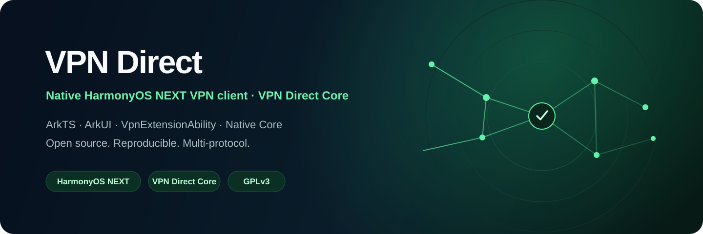

<p align="center">
  
</p>

<p align="center">
  <a href="README.md"><b>English</b></a> ·
  <a href="README_ru.md">Русский</a> ·
  <a href="README_uz.md">Oʻzbekcha</a> ·
  <a href="README_zh.md">简体中文</a>
</p>

<p align="center">
  <a href="LICENSE"></a>
  
  
  
  <a href="https://github.com/TT450/vpn-direct-app/stargazers"></a>
  <a href="https://t.me/vpndirectbot"></a>
</p>

<p align="center"><b>A native HarmonyOS NEXT VPN client powered by the reproducible VPN Direct Core.</b></p>

<p align="center">
  <a href="docs/harmony/ARCHITECTURE.md"><b>Architecture</b></a> ·
  <a href="docs/harmony/BUILDING.md"><b>Build</b></a> ·
  <a href="docs/harmony/DEVICE_QUALIFICATION.md"><b>Device Qualification</b></a> ·
  <a href="docs/core/PROTOCOL_MATRIX.md"><b>Protocol Matrix</b></a> ·
  <a href="docs/compatibility/README.md"><b>Compatibility</b></a> ·
  <a href="CONTRIBUTING.md"><b>Contribute</b></a>
</p>

---

## VPN Direct for HarmonyOS NEXT

This branch is the dedicated **HarmonyOS NEXT** platform implementation of VPN Direct. It uses the native HarmonyOS VPN extension model rather than attempting to reuse Apple runtime components.

The platform layer is intentionally thin:

- **ArkUI / ArkTS** for the application UI and platform-facing code;
- **`VpnExtensionAbility`** for the VPN lifecycle;
- **HarmonyOS TUN** for the virtual network interface;
- **N-API** for the ArkTS → native boundary;
- **VPN Direct Core** for protocol/session processing;
- the project’s pinned **sing-box-lx `v1.14.0-lx.35`** lineage underneath the Core.

### Platform architecture

```text
┌─────────────────────────────────────────────────────┐
│                 VPN Direct · HarmonyOS               │
│                    ArkUI · ArkTS                     │
└──────────────────────────┬──────────────────────────┘
                           │
                           ▼
┌─────────────────────────────────────────────────────┐
│               VpnExtensionAbility                   │
│             VPN lifecycle · permissions             │
└──────────────────────────┬──────────────────────────┘
                           │
                           ▼
┌─────────────────────────────────────────────────────┐
│                 HarmonyOS TUN                       │
│            virtual interface · routes               │
└──────────────────────────┬──────────────────────────┘
                           │
                           ▼
┌─────────────────────────────────────────────────────┐
│                  N-API bridge                       │
│                ArkTS ↔ native ABI                   │
└──────────────────────────┬──────────────────────────┘
                           │
                           ▼
┌─────────────────────────────────────────────────────┐
│                VPN Direct Core                      │
│       capabilities · configuration · runtime        │
└──────────────────────────┬──────────────────────────┘
                           │
                           ▼
┌─────────────────────────────────────────────────────┐
│              sing-box-lx v1.14.0-lx.35              │
└─────────────────────────────────────────────────────┘
```

## Adapter decision

The adapter was selected from real HarmonyOS VPN implementations rather than treating any single project as a drop-in library.

| Reference | Role | What VPN Direct takes from it |
| --- | --- | --- |
| **Hey** | Primary architecture reference | `VpnExtensionAbility` + native N-API boundary + TUN/native data-plane model |
| **HarmonyOS_VPN** | Reliability reference | VPN lifecycle, dual-stack routing, extension/process separation and real-device qualification approach |
| **ClashHM** | Secondary native-runtime reference | Native core integration and extension-oriented runtime boundary |

The implementation remains **VPN Direct-specific**. We do not copy another project's executable runtime or replace the project’s Core pin with a different sing-box release.

## Core

The HarmonyOS platform uses the same Core lineage tracked by this repository:

| Component | Pin |
| --- | --- |
| VPN Direct Core | `0.1.0` |
| sing-box source | `Leadaxe/sing-box-lx` |
| sing-box revision | `v1.14.0-lx.35` |
| upstream version | `1.14.0` |
| Go toolchain | `go1.26.6` |

The authoritative version record is [`core/VERSION`](core/VERSION). No Apple `Libbox.xcframework` is used by the HarmonyOS target.

## Security model

The native Core is application executable code and is packaged into the signed HarmonyOS application. Subscription and configuration data are data only: they cannot download, replace or hot-swap native libraries or other executable payloads.

This public repository intentionally contains no private backend credentials, production server secrets, signing material or real subscription URLs.

## Current implementation

```text
harmony/
├── AppScope/
│   └── app.json5
└── entry/
    ├── src/main/module.json5
    ├── src/main/ets/vpn/
    │   ├── VpnDirectVpnExtension.ets
    │   └── HarmonyCoreBridge.ets
    └── src/main/cpp/
        └── napi_init.cpp
```

The platform boundary is in place. The remaining engineering gate is the native ARM64 HarmonyOS build of the VPN Direct Core ABI, HAP packaging, and real-device qualification.

> **Status:** source architecture is implemented; this branch does not claim a compiled HAP or real-device qualification until DevEco build and device evidence are available.

## Documentation

| Document | Purpose |
| --- | --- |
| [HarmonyOS Architecture](docs/harmony/ARCHITECTURE.md) | Platform boundary, lifecycle and data path |
| [HarmonyOS Build Guide](docs/harmony/BUILDING.md) | DevEco / native build and packaging |
| [Device Qualification](docs/harmony/DEVICE_QUALIFICATION.md) | Real-device acceptance checklist |
| [Core Architecture](docs/core/ARCHITECTURE.md) | Shared VPN Direct Core design |
| [Core Build Guide](docs/core/BUILDING.md) | Core pins and reproducible builds |
| [Protocol Matrix](docs/core/PROTOCOL_MATRIX.md) | Parser / runtime / qualification status |
| [Compatibility](docs/compatibility/README.md) | Panels, subscriptions and protocol formats |
| [Changelog](CHANGELOG.md) | Project history |
| [Contributing](CONTRIBUTING.md) | Engineering and contribution rules |
| [Security](SECURITY.md) | Vulnerability reporting |

## Repository map

```text
vpn-direct-app/
├── harmony/                 HarmonyOS NEXT application + VPN adapter
├── ApplicationLibrary/      Shared Apple application sources
├── Extension/               Apple Packet Tunnel implementation
├── Library/                 Shared parsers / builders / Core bridge
├── core/                    VPN Direct Core + version pins
│   ├── VERSION
│   ├── protocol-matrix.json
│   ├── overlays/
│   └── sing-box/
├── scripts/                 Reproducible Core build / validation scripts
├── tests/                   Regression fixtures
├── interop/                 Interoperability scaffolding
└── docs/                    Platform and Core engineering documentation
```

## Development principles

1. Keep the platform adapter thin and the networking logic in VPN Direct Core.
2. Use capability discovery instead of hardcoding protocol assumptions.
3. Fail closed when a feature is not proven by the linked Core.
4. Keep executable Core code inside the signed application package.
5. Never commit credentials, signing keys, private server material or production subscription URLs.
6. Do not mark a protocol `tested` without real-device and interoperability evidence.

## License

VPN Direct is distributed under the **GNU General Public License v3 or later**.

See [`LICENSE`](LICENSE), [`NOTICE`](NOTICE) and [`docs/core/LICENSE_AUDIT.md`](docs/core/LICENSE_AUDIT.md).

---

<p align="center">
  <b>VPN Direct · HarmonyOS NEXT</b><br/>
  Native platform adapter · reproducible Core · explicit capabilities
</p>
