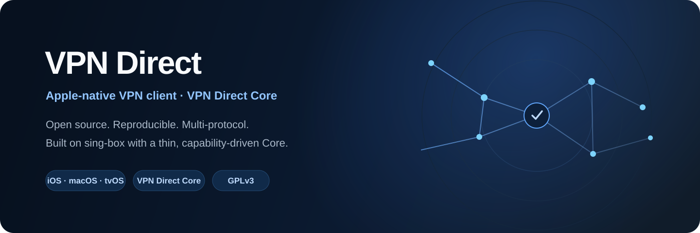

<p align="center">
  
</p>

<p align="center">
  <a href="README.md"><b>English</b></a> ·
  <a href="README_ru.md">Русский</a> ·
  <a href="README_uz.md">Oʻzbekcha</a> ·
  <a href="README_zh.md">简体中文</a>
</p>

<p align="center">
  <a href="https://github.com/TT450/vpn-direct-app/actions/workflows/core-baseline.yml"></a>
  <a href="LICENSE"></a>
  
  <a href="https://github.com/TT450/vpn-direct-app/stargazers"></a>
  <a href="https://t.me/vpndirectbot"></a>
</p>

<p align="center"><b>A native Apple VPN client with its own reproducible, capability-driven Core built on sing-box.</b></p>

<p align="center">
  <a href="https://apps.apple.com/app/id6807402257"><b>App Store</b></a> ·
  <a href="https://testflight.apple.com/join/yfCEbunt"><b>TestFlight</b></a> ·
  <a href="docs/compatibility/README.md"><b>Compatibility & Providers</b></a> ·
  <a href="docs/core/ARCHITECTURE.md"><b>Architecture</b></a> ·
  <a href="docs/core/PROTOCOL_MATRIX.md"><b>Protocol Matrix</b></a> ·
  <a href="docs/core/BUILDING.md"><b>Build</b></a> ·
  <a href="CONTRIBUTING.md"><b>Contribute</b></a>
</p>

---

## VPN Direct

VPN Direct is an open-source VPN client for **iOS, macOS and tvOS**.

The Apple application keeps the proven `NetworkExtension` / `PacketTunnelProvider` architecture, while the networking layer is moving to **VPN Direct Core** — a thin, reproducible Core based on sing-box and selected upstream-compatible extensions.

The project is designed around four principles:

- **Native Apple integration** — system VPN tunnel, Network Extension lifecycle and Apple platform support.
- **Capability-driven Core** — the application asks the linked Core what it actually supports instead of guessing.
- **Reproducible builds** — Core version, sing-box pin, Go toolchain, gomobile and build profiles are tracked.
- **No silent protocol substitution** — unsupported features fail explicitly instead of being converted into another transport.

## Why VPN Direct Core?

VPN Direct Core keeps the Apple application stable while making the networking layer independently maintainable.

```text
Subscription / Config
        │
        ▼
Content Detector
        │
        ▼
Universal Parser / Format Adapters
        │
        ▼
NormalizedSubscription → Location → Node
        │
        ▼
Capability Resolver + Outbound Builder
        │
        ▼
VPN Direct Core (Libbox / sing-box)
        │
        ▼
NetworkExtension
```

The Core remains intentionally close to upstream sing-box. Custom functionality should stay isolated behind build tags, overlays or small patches so upstream updates remain realistic.

## Current Core status

Latest published: [`v1.0.11.63`](https://github.com/TT450/vpn-direct-app/releases/tag/v1.0.11.63) (marketing **1.0.11**, TestFlight build **63**) · Core pin: see [`core/VERSION`](core/VERSION) (`sing-box-lx` / Go / gomobile).

A feature is not **production / `tested`** merely because a builder exists. Production requires:

`import → Core validation → Packet Tunnel start → handshake → TCP/UDP → DNS → reconnect → iOS memory check`

Authoritative row-level status: [Protocol Matrix](docs/core/PROTOCOL_MATRIX.md) · machine-readable [`core/protocol-matrix.json`](core/protocol-matrix.json).

**v1.0.6 is battle-key qualification-ready** (parsers + Core + interop templates). Matrix Interop stays `planned` until live evidence is attached — do not treat `parser+runtime` as `tested`.

| Area | State |
| --- | --- |
| Custom Libbox build + Core baseline CI | Implemented (fixtures, ABI, Libbox, SFI) |
| Core ABI + CapabilityJSON (fail-closed) | Implemented |
| Remnawave / Happ topology (locations, Auto, detour) | Implemented (harvest P0) |
| VLESS TCP / TLS / REALITY / WS / gRPC / HTTPUpgrade | Runtime baseline |
| VLESS XHTTP / encryption (PQ) | Parser + runtime; interop qualification ongoing |
| Hysteria / Hysteria2 (+ share + Xray) | Parser + runtime; interop ongoing |
| VMess / Trojan / Shadowsocks / TUIC / AnyTLS / ShadowTLS / Naive | Parser + builder; interop ongoing |
| WireGuard / AmneziaWG 2–3.1 (URI + `.conf`) | Parser + runtime; device qualification ongoing |
| MASQUE CONNECT-IP / WARP profile | Parser + runtime; qualification ongoing |
| Clash / Mihomo YAML (proxies + nested opts) | Implemented |
| Content detector + production gate | Implemented (`make check-production-ready`) |
| Mieru | Parser + Core runtime (`with_mieru`); interop planned |
| Interop lab / iPhone `tested` evidence | Runnable templates + checklist; live evidence pending |
| CONNECT-UDP / Tailscale / OpenVPN import | Shipped in **1.0.10** (parser + graph); device Libbox rebuild / qualification ongoing |
| Home / Control Center widgets | Shipped in **1.0.11**; in-place toggle + status polish in **1.0.11.63** |

## Architecture

```text
┌───────────────────────────────────────────────┐
│                 VPN Direct App                │
│          SwiftUI · iOS · macOS · tvOS         │
└──────────────────────┬────────────────────────┘
                       │
                       ▼
┌───────────────────────────────────────────────┐
│              Network Extension                │
│     PacketTunnelProvider · tunnel lifecycle   │
└──────────────────────┬────────────────────────┘
                       │
                       ▼
┌───────────────────────────────────────────────┐
│              VPN Direct Core API              │
│     ABI · capabilities · builders · errors    │
└──────────────────────┬────────────────────────┘
                       │
                       ▼
┌───────────────────────────────────────────────┐
│                    Libbox                     │
│      sing-box-lx pin + isolated overlays      │
└──────────────────────┬────────────────────────┘
                       │
                       ▼
┌───────────────────────────────────────────────┐
│                 sing-box stack                │
└───────────────────────────────────────────────┘
```

More detail: [`docs/core/ARCHITECTURE.md`](docs/core/ARCHITECTURE.md)

## Build profiles

| Profile | Purpose |
| --- | --- |
| `vpn_direct_ios_minimal` | Small Apple/NE-oriented baseline |
| `vpn_direct_ios` | Default production Apple profile |
| `vpn_direct_full` | Development / extended protocol surface |

Profiles live in [`scripts/tags/`](scripts/tags/).

## Build from source

**Requirements:** macOS, Xcode, the Go version pinned in [`core/VERSION`](core/VERSION), and an Apple Developer Team with Network Extension/App Group entitlements.

```bash
git clone --recurse-submodules https://github.com/TT450/vpn-direct-app.git
cd vpn-direct-app

./scripts/bootstrap_core.sh
make libbox
make check-fixtures
make check-abi
make check-production-ready
```

Open `sing-box.xcodeproj` and use:

| Platform | Scheme |
| --- | --- |
| iOS | `SFI` |
| macOS | `SFM` / `SFM.System` |
| tvOS | `SFT` |

Detailed instructions: [`docs/core/BUILDING.md`](docs/core/BUILDING.md)

## Repository map

```text
vpn-direct-app/
├── ApplicationLibrary/      Apple UI and app-specific components
├── Extension/               Packet Tunnel / Network Extension
├── Library/                 Core bridge, subscriptions, VPNDirect parsers/builders
├── core/
│   ├── VERSION              Core/toolchain pins
│   ├── protocol-matrix.json Machine-readable matrix
│   ├── overlays/            VPN Direct Libbox capability layer
│   └── sing-box/            pinned Core source submodule
├── scripts/
│   ├── build_libbox.sh
│   ├── check_abi.sh
│   ├── check_fixtures.sh
│   ├── check_universal_parsers.sh
│   ├── check_production_ready.sh
│   └── tags/                Core build profiles
├── tests/fixtures/          regression fixtures
├── interop/                 interoperability scaffolds + evidence/
├── docs/core/               Core architecture and engineering docs
└── docs/device/             iPhone qualification checklist
```

## Documentation

| Document | Purpose |
| --- | --- |
| [Compatibility & Providers](docs/compatibility/README.md) | Panel / subscription / protocol knowledge base |
| [Architecture](docs/core/ARCHITECTURE.md) | Core design and Apple import pipeline |
| [Build Guide](docs/core/BUILDING.md) | Reproduce Libbox and Apple builds |
| [Protocol Matrix](docs/core/PROTOCOL_MATRIX.md) | What is parsed, compiled, tested and production-ready |
| [Release Blocker Ledger](docs/core/RELEASE_BLOCKER_LEDGER.md) | Open vs verified release blockers |
| [Roadmap](ROADMAP.md) | Public product roadmap |
| [What's New](WHATS_NEW.md) | Latest release notes (`v1.0.11.63`) |
| [Changelog](CHANGELOG.md) | Full version history |
| [TestFlight](docs/TESTFLIGHT.md) | Beta install + how to invite testers |
| [Donors](docs/core/DONORS.md) | Upstream and donor source tracking |
| [License Audit](docs/core/LICENSE_AUDIT.md) | Dependency/license engineering notes |
| [iPhone Qualification](docs/device/IPHONE_QUALIFICATION.md) | Device evidence checklist |

## Public identifiers

| | |
| --- | --- |
| App | VPN Direct |
| Bundle ID | `com.vpndirect.vpndirectapp` |
| Packet Tunnel | `com.vpndirect.vpndirectapp.SingBoxPacketTunnel` |
| App Group | `group.com.vpndirect.vpndirectapp` |
| URL scheme | `vpndirect://` |
| App Store ID | `6807402257` |
| TestFlight | [Join](https://testflight.apple.com/join/yfCEbunt) · [`docs/TESTFLIGHT.md`](docs/TESTFLIGHT.md) |

Secrets and signing credentials are not stored in this repository.

## Contributing

Contributions are welcome. Read [`CONTRIBUTING.md`](CONTRIBUTING.md) before opening a PR.

For protocol changes:
- add/update regression fixtures;
- update the Protocol Matrix;
- do not commit real subscription URLs, private keys, credentials or signing secrets.

Security issues should follow [`SECURITY.md`](SECURITY.md), not public bug reports.

## Upstream & acknowledgements

VPN Direct builds on the work of:

- [SagerNet/sing-box](https://github.com/SagerNet/sing-box)
- [SagerNet/sing-box-for-apple](https://github.com/SagerNet/sing-box-for-apple)
- [Leadaxe/sing-box-lx](https://github.com/Leadaxe/sing-box-lx)
- the wider sing-box / Libbox ecosystem

See [`docs/core/DONORS.md`](docs/core/DONORS.md) for source strategy.

## License

VPN Direct is distributed under the **GNU General Public License v3 or later**.

See [`LICENSE`](LICENSE), [`NOTICE`](NOTICE) and [`docs/core/LICENSE_AUDIT.md`](docs/core/LICENSE_AUDIT.md).

---

<p align="center">
  <b>VPN Direct</b><br/>
  Native Apple client · reproducible Core · explicit capabilities
</p>
